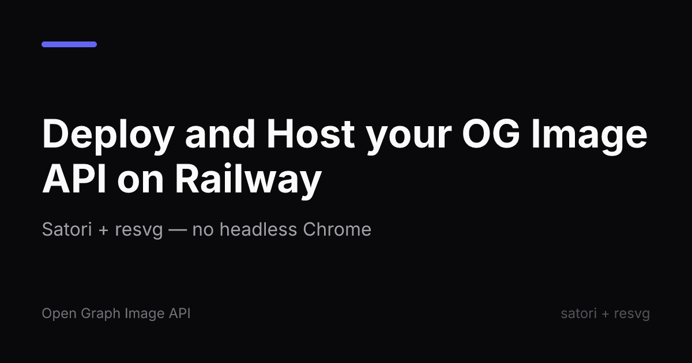
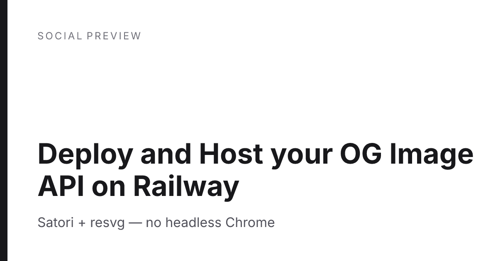
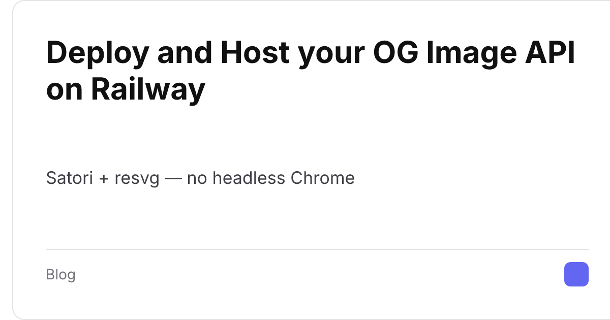

# og-image-generator

Self-hosted Open Graph (social preview) image generator as an HTTP API.
Renders `GET /og?title=...&theme=...` straight to PNG using
[satori](https://github.com/vercel/satori) + [@resvg/resvg-js](https://github.com/thx/resvg-js) —
**no headless Chrome**, no Puppeteer, no browser binaries. A 1200x630 card renders in
tens of milliseconds inside ~250MB of RSS, so a $5/mo 512MB Railway instance is plenty.

- 4 built-in themes (`dark`, `light`, `gradient`, `card`), Inter typeface baked in
- Full offline color-emoji support (4,009 vendored twemoji SVGs)
- Deterministic rendering (system fonts disabled) + in-memory LRU cache
- `POST /og` for JSON-body rendering, `GET /themes` for discovery, `GET /health` for probes
- Opt-in remote logos behind an SSRF-hardened fetcher (`ALLOW_REMOTE_ASSETS=false` by default)

## Deploy on Railway

[](https://railway.app/new?github_url=https://github.com/OWNER/og-image-generator)

Zero configuration: no environment variables are required. Railway injects `PORT`
and the container listens on it. The public URL is provisioned automatically.

## API

### `GET /og` (and `POST /og` with a JSON body)

Returns `image/png` with `Cache-Control: public, max-age=86400`.

| Parameter  | Type            | Default | Notes                                                        |
|------------|-----------------|---------|--------------------------------------------------------------|
| `title`    | string, required| —       | max 280 chars, auto-wrapped, clamped with an ellipsis; emoji and unicode supported |
| `subtitle` | string          | —       | max 160 chars                                                 |
| `theme`    | enum            | `dark`  | `dark` \| `light` \| `gradient` \| `card`                     |
| `logo`     | URL string      | —       | `http(s)` image URL; **requires** `ALLOW_REMOTE_ASSETS=true`  |
| `width`    | int             | `1200`  | 200–4096                                                      |
| `height`   | int             | `630`   | 200–4096                                                      |

```bash
curl -o card.png "https://your-app.up.railway.app/og?title=Ship%20faster%20%F0%9F%9A%80&theme=gradient"

curl -X POST https://your-app.up.railway.app/og \
  -H 'content-type: application/json' \
  -d '{"title":"Posted via JSON","subtitle":"preset override","theme":"card"}' -o card.png
```

### `GET /themes`

Lists the built-in themes with one sample URL each.

### `GET /health`

`{"status":"ok","uptimeSec":123,"memory":{"rssMB":180,"heapUsedMB":95},"cacheEntries":7,"themes":4}`

## Themes

| Dark | Light | Gradient | Card |
|------|-------|----------|------|
|  |  |  |  |

## Environment variables (all optional — the template ships with none set)

| Variable              | Default    | Description                                                                 |
|-----------------------|------------|-----------------------------------------------------------------------------|
| `PORT`                | `3000`     | Listen port. Railway injects this automatically — do not set it manually.    |
| `ALLOW_REMOTE_ASSETS` | `false`    | When `true`, `logo` accepts remote `http(s)` image URLs (SSRF-hardened).      |
| `CACHE_MAX_ENTRIES`   | `100`      | In-memory LRU size for rendered PNGs. `0` disables caching.                   |
| `FONTS_DIR`           | `/fonts`   | Optional. Mount a volume with extra `.ttf`/`.otf` files; they are registered as glyph fallbacks (e.g. Noto Sans for CJK). Files named like `Inter-Regular.ttf` are also picked up by filename convention. |

## Remote logos and SSRF hardening

Remote fetching is **off by default**. With `ALLOW_REMOTE_ASSETS=true`, every
`logo` request goes through a guard that: allows only `http`/`https`; follows up
to 3 redirects manually, re-validating each hop; resolves DNS and rejects any
address that is loopback, RFC1918 private, CGNAT (100.64.0.0/10), link-local
(including cloud metadata `169.254.169.254`), ULA, multicast, or otherwise
reserved; enforces a 5s timeout, a 2MB size cap, and an `image/*` content type.

Known residual risk: DNS-rebinding TOCTOU (validation and fetch resolve DNS
independently). If your threat model includes attacker-controlled DNS, keep
remote assets disabled or front the service with an egress proxy.

## Custom fonts

Mount a volume at `/fonts` (Railway: Service → Volumes → mount path `/fonts`)
containing `.ttf`/`.otf` files and restart. They are registered as fallback
fonts; text glyphs missing from Inter (e.g. CJK) then render from your font.
Emoji rendering is independent and always uses the bundled twemoji set.

## Local development

```bash
npm ci
npm run build
ASSETS_DIR=./assets PORT=3000 npm start   # assets are fetched during docker build; see Dockerfile
# or simply:
docker build -t og-image-generator . && docker run -p 3000:3000 og-image-generator
```

Verification battery against any deployed instance:

```bash
BASE_URL=https://your-app.up.railway.app bash scripts/verify.sh
```

## Licenses

Template code: MIT (see `LICENSE`). Bundled third-party assets and runtime
libraries are covered by their own licenses — Inter (SIL OFL 1.1), twemoji
artwork (CC-BY 4.0), satori and resvg-js (MPL-2.0). See `NOTICE.md`.
